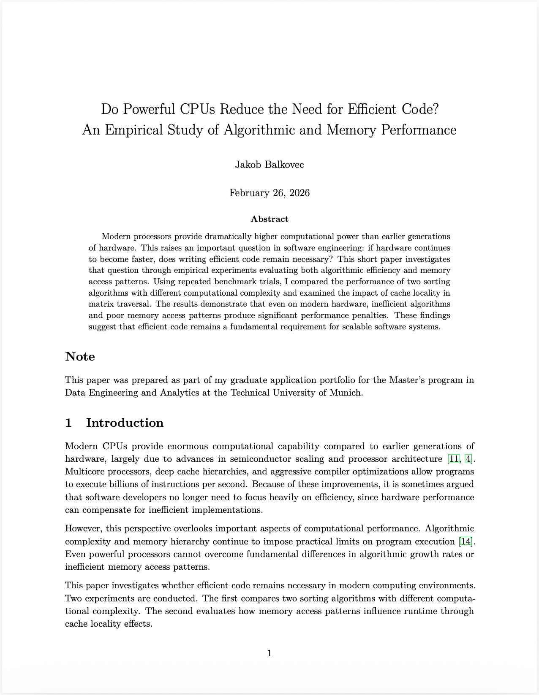

# CPU Benchmarks

This repository contains the benchmark code and paper for:  
**Do Powerful CPUs Reduce the Need for Efficient Code?**

The paper was written as an **acceptance essay for the Master's program in Data Engineering and Analytics at the Technical University of Munich (TUM)**. It investigates whether improvements in modern processor performance reduce the practical importance of efficient algorithms and memory-aware implementations.
